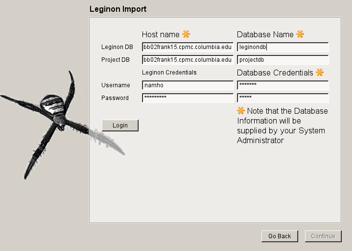
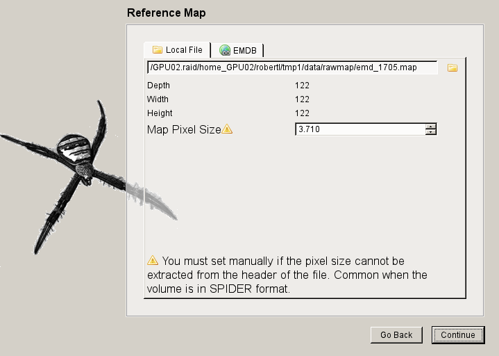
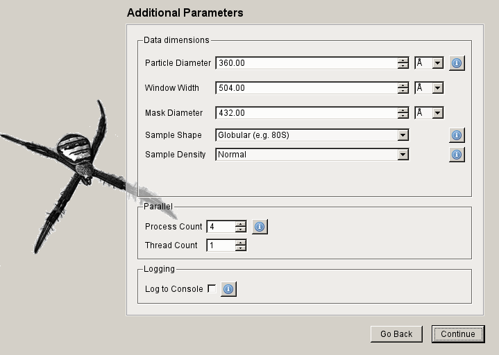
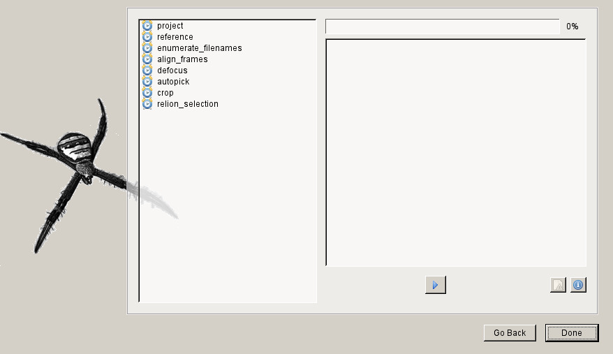

=======================
Reconstruction Protocol
=======================

.. include:: includes/icons.rst

.. toctree::
	:maxdepth: 0
	:hidden:
	
	reconstruction_cmdline

This tutorial covers setting up a workflow for preprocessing images for 3D angular 
refinement using the Arachnid Graphical User Interface (GUI).  The GUI allows 
for an effective, easy, interactive wizard for the pre-processing of electron 
micrograph data. The design, scope, and rationale for this workflow can be found 
in the :doc:`References <../CITE>` section of the website. The workflow 
has been benchmarked for a variety of single-particle reconstruction projects.

All commands and options in the program can alternatively be accessed and run 
via the command line. This is covered in the 
:doc:`Command-line Protocol <reconstruction_cmdline>`. This tutorial 
also assumes that :doc:`installation <install>` of the program was successful.

.. note::

	While there are advantages to running the command-line version, it does not currently support 
	certain features such as Leginon database import.
	
Quick Start
===========

The following tutorial will take you step-by-step through the use of the Arachnid GUI. Each section
is accompanied by a screen shot illustrating what you will see after the GUI has been launched.

To lauch the GUI, run the following on the terminal:

	.. sourcecode:: sh
	
		$ ara-control

Introduction
------------
	
The first page in the workflow wizard (illustrated in the screen shot below) 
gives the user basic information concerning the software including contributions 
made by people and funding agencies.
	
	.. image:: images/wizard/wizard_screen_shot_0000.png
		:scale: 60%

Import Prompt
-------------

Next, the user is asked whether they wish to automatically import or manually enter information 
describing the experiment.

If the user clicks |accept_icon| "Yes", then the program will attempt to connect to the Leginon Database and retrieve 
their most recent sessions. The user will then be able to select multiple sessions and this information will 
be used to fill the next page: **Manual Settings**.

If the user clicks |reject_icon| "No", then the program will show the **Manual Settings** page where the user will be prompted 
to manually enter information concerning the data.

	.. image:: images/wizard/wizard_screen_shot_0010.png
		:scale: 60%

.. note::
	
	Certain pages have an information button |info_icon|. By clicking this button a separate window is opened, 
	displaying relevant help information. This window can be left open and will be updated as the user clicks 
	such buttons on later pages.

Leginon Database Import
-----------------------

If the user elects to import information from the Leginon database, then they will see one of
the following pages.

Leginon Account
~~~~~~~~~~~~~~~

If this is the user's first time using the program on the current machine, then user will be shown
the following page prompting the user for the following information:
	
	- Hostname or IP Address for Leginon Primary Database followed by name of the database
	- Hostname or IP Address of Leginon Project Database followed by name of the database
	- Leginon Credentials (Specific to each user)
	- Database Credentials
	
.. note::
	
	Since most of the information, excluding the Leginon Credentials, is universal to the lab,
	the system administrator should provide this information.

Leginon Sessions
~~~~~~~~~~~~~~~~

Once you have successfully logged into the Leginon Database, the following page will be displayed:

.. note::

	If this is not your first time, then you should see this page first.
	
The |user_icon| `Change User` button displays a settings panel where the user can change their 
username or information regarding the Leginon database.

In the table picture in the screen shot below, the last session for which you collected data should be 
displayed. More sessions can be viewed by increasing the `Show last` number shown and then clicking 
the |refresh_icon| `Refresh` button. By default, only the most recent session is shown.

.. image:: images/wizard/wizard_screen_shot_0020.png
	:scale: 60%

Manual Settings
---------------

After selecting a session from Leginon or skipping the database import, the next page asks the user
to enter the following information:

	- File path for the micrograph exposures (either single images or stacks)
	- Gain normalization image (only used for movie-mode stacks)
	- Contrast inversion (generally exposures taken on a CCD or CMOS camera must be inverted)
	- Microscope parameters (later used for CTF estimation)
		- Pixel size (Pixel/angstroms)
		- Acceleration Voltage or High tension (kV)
		- Spherical Abberation or CS (mm)
	
.. image:: images/wizard/wizard_screen_shot_0030.png
	:scale: 60%

Reference Preprocessing Prompt
------------------------------

Next the user is asked whether they wish to preprocess a volume to use as a
reference. The reference generation script will ensure the volume as the 
proper window size and pixel size as well as inital resolution for filtering.

.. note:: :py:mod:`More information on reference generation <arachnid.pyspider.reference>`

If the user clicks |accept_icon| "Yes", then the user will be asked to either locate
a local file to use as a reference or download a file from the EMDB.

.. image:: images/wizard/wizard_screen_shot_0040.png
	:scale: 60%

Reference Map Generation
-------------------------

The user is given the option of downloading a volume from the EMDB or locating
a local file containing a volume to be used as a reference.

.. note::
	
	If you already have a volume, then you can select the `Local File` tab

EMDB Download
~~~~~~~~~~~~~

The user has the option of selecting one of the curated volumes displayed in the list by double clicking
on the icon. Otherwise, the user can enter an EMDB accession number into the text box below.

The user then has the option of viewing the EMDB webpage associated with the accession number using
the |link_icon| `Link` button.

When the user has selected the appropriate volume, the user can then click the |download_icon| `Download` button.

.. note::

	Depending on the pixel size, it can take some time to download the map: don't panic.

.. image:: images/wizard/wizard_screen_shot_0052.png
	:scale: 60%

Local File
~~~~~~~~~~

After the user downloads a volume or has gone directly to the local file page and opened a volume file, 
the following information about the volume will be displayed.

.. warning:: 
	
	The user must verify or must enter the current Pixel Size for the volume (not the target pixel size
	corresponding to your data!).
	

Additional Parameters
---------------------

The user is then prompted to enter information describing both the macromolecule of interest, 
a qualitative assessment of the particle crowding on the micrograph and the amount of 
processing power they wish to use.

.. note::
	
	The mask diameter should be the same value as will be used in angular refinement,
	e.g. Relion.

Review Parameters
-----------------

The user is next asked to review the settings of the individual sub-programs. Generally, this
will only be used by advanced users that understand how each parameter affects the underlying
steps in the workflow.

After clicking on a particular parameter and hitting the |link_icon| `Link` button, a brower
will display the manual page associated with that parameter.

.. image:: images/wizard/wizard_screen_shot_0070.png
	:scale: 60%
	
Run the Workflow
----------------

Finally, the user is present with the workflow monitor. The user can start
the preprocessing and monitor the progress from this screen.

.. note::

	The user cannot kill the workflow by closing the window or by clicking
	the stop button.

Restarting the `ara-control` script in the original directory where it was run 
allows the user to continue montoring the progress from the same or a 
different computer.

Tips
====

1. Check the particle selection in ara-screen
	
	By default, ara-screen displays the power spectra

2. Check the reference
	
	Use Chimera to visualize the reference

3. Check the contrast inversion of the micrograph.
	
	It is assumed that your micrograph requires contrast inversion and the parameter `--is-film` 
	can keep the current contrast. You want light particles on a dark background.

4. Check normalization when preparing the data for Relion

	For Arachnid=0.1.2 the particle-diameter must match the mask diameter used in Relion.
	For Arachnid=0.1.3 and later the mask-diamter must match the mask diameter used in Relion.

5. Suggested AutoPicker parameters for various conditions/samples (These parameters are set for you in the GUI)

	1. Crowded micrographs: --overlap-mult 0.8
	2. Very asymmetric particles (40S subunit of the ribosome) --disk-mult 0.2 
	3. Very few particles --threshold-minimum 10 (only works for Arachnid 0.1.3 or later)

6. Very Dirty Dataset - Use ara-vicer

	You must first run a short Relion Refinement, suggested on 4x decimated data. It does not have to run to the end, but 
	the longer you run it the better ara-vicer will work.
	
	To run, do the following
	
	.. sourcecode:: sh
		
		# Determine the good particles
		
		$ ara-vicer cluster/win/win_*.dat -a relion_it012_data.star -o output/view_0000000.dat -w8 -p cluster/data/params.dat 
		
	Note that this script writes out a relion selection file with the name view.star.

