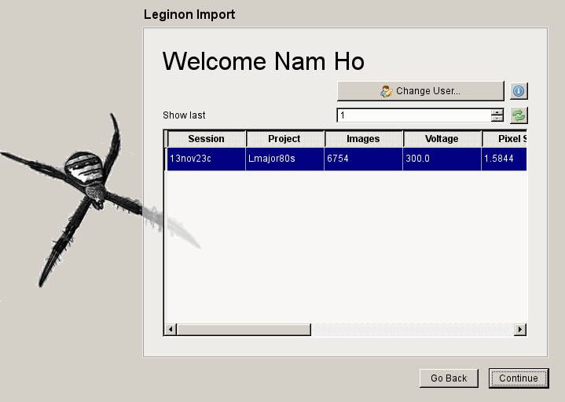

=======================
Reconstruction Protocol
=======================

.. toctree::
	:maxdepth: 1
	:hidden:
	
	reconstruction_cmdline

This protocol describes single-particle reconstruction of a biological specimen (e.g. the ribosome) 
from a collection of electron micrographs. 

This tutorial covers setting up a workflow for preprocessing images for 3D angular refinement using
a graphical User Interface. You may alternatively wish to run everything from the command line. This 
is covered in the  :doc:`Command-line Protocol <reconstruction_cmdline>`.

.. note::

	The command line version of the program does not currently support certain features
	such as Leginon database import.

.. contents:: 
	:depth: 1
	:local:
	:backlinks: none
	
Quick Start
===========

#. Run the following to load the Graphical User Interface.

	.. sourcecode:: sh
	
		$ ara-control

Introduction
------------
	
The first page in the workflow wizard gives the user basic information
concerning the software including contributions made by people and funding
agencies.
	
	.. image:: images/wizard_screen_shot_0000.png
		:scale: 20%
		:target: content_

	.. _content:

	.. container:: content
		
		.. image:: images/wizard_screen_shot_0000.png
		
Import Prompt
-------------

Next, the user is asked whether they wish to automatically import or manually enter information 
describing the experiment.

If the user clicks Yes, then the program will attempt to connect to the Leginon Database and retrieve 
their most recent sessions. The user will be able to select multiple sessions and this information will 
be used to fill the next page: Manual Settings.

If the user clicks No, then the program will show the Manual Settings page where the user will be prompted 
to manually enter information concerning the data.

	.. image:: images/wizard_screen_shot_0010.png
		:scale: 20%
		:target: content02_

	.. _content02:

	.. container:: content
		
		.. image:: images/wizard_screen_shot_0010.png

Leginon Database Import
-----------------------

If the user elects to import information from the Leginon database, then they will see one of
the following pages.

Leginon Account
~~~~~~~~~~~~~~~

This page asks the user for the following information:
	
	- Hostname or IP Address for Leginon Primary Database followed by name of the database
	- Hostname or IP Address of Leginon Project Database followed by name of the database
	- Leginon Credentials (You should know this)
	- Database Credentials
	
.. note::
	
	The system administrator should provide all the information expect the Leginon Credentials.

.. image:: images/wizard_screen_shot_0022.png
	:scale: 20%
	:target: content03_

.. _content03:

.. container:: content
	
	.. image:: images/wizard_screen_shot_0022.png

Leginon Sessions
~~~~~~~~~~~~~~~~

Once you have successfully logged into the Leginon Database, then the following page will be displayed:

.. note::

	If this is not your first time, then you should see this page first.
	
The `Change User` button displays a settings panel where the user can change their username or information
concerning the Leginon database.

By default, only the most recent session is shown. More sessions can be displayed by increasting the
`Show last` number and then clicking the refresh button.

Also, the page contains an information button. By clicking this button a separate window is opened
display relavent help information. This window can be left open and will be updated as the user
clicks such buttons on later pages.

In the table below, the last session for which you collected data should be displayed. More sessions
can be viewed by increasing the `Show last` number shown and then clicking the refresh button.

.. _content04:

.. container:: content
	
	.. image:: images/wizard_screen_shot_0020.png

Manual Settings
---------------

After selecting a session from Leginon or skipping the database import, the next page asks the user
to enter the following information:

	- File path for the micrograph exposures (either single images or stacks)
	- Gain normalization image (only used for movie-mode stacks)
	- Contrast inversion
	- Microscope parameters
		- Pixel size (1/angstroms)
		- Voltage aka High tension (kV)
		- Spherical Abberation aka CS (mm)
	
.. image:: images/wizard_screen_shot_0030.png
	:scale: 20%
	:target: content06_

.. _content06:

.. container:: content
	
	.. image:: images/wizard_screen_shot_0030.png

Reference Prompt
----------------

Next the user is asked whether they wish to preprocess a volume to use as a
reference. The reference generation script will ensure the volume as the 
proper window size and pixel size as well as filtering it to a low resolution.

.. image:: images/wizard_screen_shot_0040.png
	:scale: 20%
	:target: content07_

.. _content07:

.. container:: content
	
	.. image:: images/wizard_screen_shot_0040.png

Reference Generation
--------------------

EMDB Download
~~~~~~~~~~~~~

The user is given the option of downloading a volume from the EMDB.

.. note::
	
	If you already have a volume, then you can select the `Local File` tab

The user has the option of selecting one of the "canned" volumes displayed in the list by double clicking
on the icon. Otherwise, the user can enter an EMDB accession number into the text box below.

The user then has the option of viewing the EMDB page associated with the accession number using
the world link button.

When the user has selected the appropriate volume, the user can then click the download button.

.. note::

	It can take some time to download the map, don't panic.

.. image:: images/wizard_screen_shot_0052.png
	:scale: 20%
	:target: content08_

.. _content08:

.. container:: content
	
	.. image:: images/wizard_screen_shot_0052.png

Local File
~~~~~~~~~~

After the user downloads a volume or the user opted to go directly to the local file page.

Here, the user can verify or must enter the current Pixel Size for the volume (not the target pixel size
corresponding to your data!).
	
.. image:: images/wizard_screen_shot_0050.png
	:scale: 20%
	:target: content09_

.. _content09:

.. container:: content
	
	.. image:: images/wizard_screen_shot_0050.png

Additional Parameters
---------------------

The user is then prompted to enter information describing both the macromolecule of interest, 
a qualititative assessment of the particle crowding on the micrograph and the amount of 
processing power they wish to use.

.. image:: images/wizard_screen_shot_0060.png
	:scale: 20%
	:target: content10_

.. _content10:

.. container:: content
	
	.. image:: images/wizard_screen_shot_0060.png

Review Parameters
-----------------

The user is next asked to review the settings of the individual progams. Generally, this
will only be used by advanced users that understand how each parameter affects the underlying
steps in the workflow.

.. image:: images/wizard_screen_shot_0070.png
	:scale: 20%
	:target: content11_

.. _content11:

.. container:: content
	
	.. image:: images/wizard_screen_shot_0070.png
	
Run the Workflow
----------------

Finally, the user is present with the workflow monitor. The user can start
the processing and then monitor its progress from this screen.

.. note::

	The user cannot kill the workflow by closing the window to clicking
	the stop button.

Restarting the `ara-control` script in the original directory it was run allows the user
to continue montoring the progress from the same or a different computer.

.. image:: images/wizard_screen_shot_0080.png
	:scale: 20%
	:target: content12_

.. _content12:

.. container:: content
	
	.. image:: images/wizard_screen_shot_0080.png

Tips
====

1. Check the particle selection in ara-screen
	
	By default, ara-screen displays the power spectra

2. Check the reference
	
	Use Chimera to visualize the reference

3. Check the contrast inversion of the micrograph.
	
	It is assumed that your micrograph requires contrast inversion and the parameter `--is-film` 
	can keep the current contrast. You want light particles on a dark background.

4. Check normalization when preparing the data for Relion

	For Arachnid=0.1.2 the particle-diameter must match the mask diameter used in Relion.
	For Arachnid=0.1.3 the mask-diamter must match the mask diameter used in Relion.

5. Suggested AutoPicker parameters for various conditions/samples

	1. Crowded micrographs: --overlap-mult 0.8
	2. Very asymmetric particles (40S subunit of the ribosome) --disk-mult 0.2 
	3. Very few particles --threshold-minimum 10 (only works for Arachnid 0.1.3 or later)

6. Very Dirty Dataset - Use ara-vicer

	You must first run a short Relion Refinement, suggested on 4x decimated data. It does not have to run to the end, but 
	the longer you run it the better ara-vicer will work.
	
	To run, do the following
	
	.. sourcecode:: sh
		
		# Determine the good particles
		
		$ ara-vicer cluster/win/win_*.dat -a relion_it012_data.star -o output/view_0000000.dat -w8 -p cluster/data/params.dat 
		
	Note that this script writes out a relion selection file with the name view.star.

